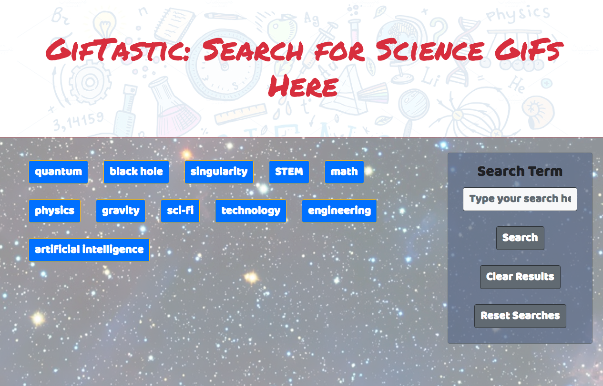

# GifTastic
## Summary
This web app utilizes the GIPHY API to retrieve animated GIFs related to the Science-related terms. There are preexisting terms built-in to the page and user can click these to get the associated GIFs to be displayed in the form of Cards. The GIFs are displayed as still images but they are animated once the user clicks on them. The search results are limmited to 10. The users can define and search for their preffered terms using the search box to the left. This creates a button and upon click displays the GIFs. Only 10 results re displayed per search. New searches are __prepended__ to the at the top of existing ones. User can always clear the results or the button if clutter becomes a concern. 


___

### Under the Hood
The process is mainly controlled by an object named ```giftastic```. Various fucntions of the object control how the results and buttons are displayed on the page as well as how they can be cleared. These functions are namely,
+ ```giftastic.initBtns()``` and ```giftastic.oneBtn()``` (for displaying buttons)
+ ```giftastic.dispResult(results)``` (for displaying results as Bootstrap Card Columns where result is JSON returned from the GIPHY API query)
+ ```giftastic.clearAll()``` and ```giftastic.clearReset()``` (for clearing the results and reseting the buttons to initial form).

Various stages during the user interraction is controlled by individual functions or a combination of them (i.e. addition of a new search term clears the search buttens adds a new search term to the ```giftastic.topics``` array and runs ```giftastic.initBtns()``` again to display the new gather of buttons with the addition)

The main query parameters are handled by the url setup function  ```giftastic.baseURL(searchTerm)``` which makes  use of ```$.param``` to add search parameters to the url. 
```javascript
"http://api.giphy.com/v1/gifs/search" +
"?" + $.param({
'api_key': APIkey,
'q': SRCH + "+science", 
'limit': 10,
})
```

Note that the search term SRCH is concatinated with ```"+science"``` in order to prevent query returning irrelevant results. This function is called by ```giftastic.getJSON(SearchTerm)``` which is a callback function of the associated button class ```.topicBtn```  in \<div\> with  id ```#gifDiv```. After receiving the url for the API query, ```giftastic.getJSON(SearchTerm)``` handles the rest of the querry and passes the results to the ```giftastic.dispResult(results)``` for the card-column display. The clear Results and Reset Searches buttons resets the GIF display and the Button Display making use of the JQuery ```.empty()``` function.

The Animation of the gifs upon click are controlled by the HTML attributes defined in the \ tags for the gifs. Here, each tag has a switch ```still``` set to true or false in the tag indicating if the GF has been animated by a click or not. Clicking the GIF changes its ```src``` attribute to an animated image from the result from the JSON object returned by the query. This and the still image source url is also embedded in the \ tag as  ```src_anim``` and ```src_still``` in the section which setups the cards, namely, ```giftastic.dispResult(results)```. Additional information associated with the GIFs are also displayed in card body such as
1. GIF title
1. GIF rating
1. GIF width and Height in pixels.
1. GIF file size in Mb
1. GIF embed link as card footer


